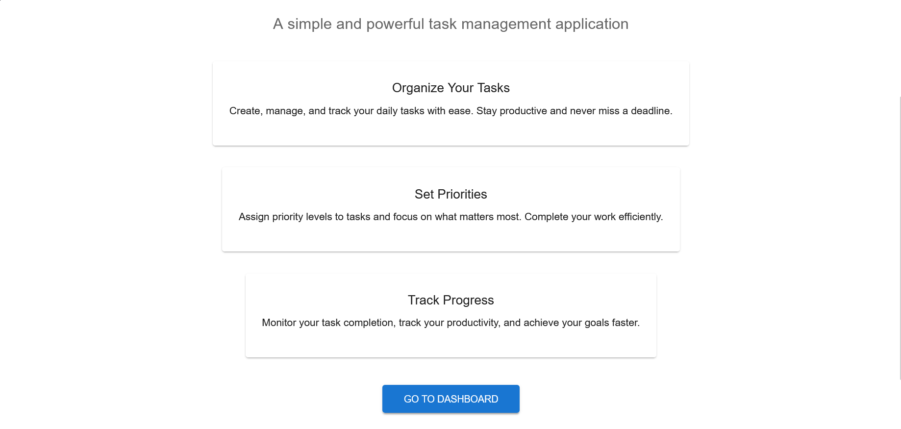
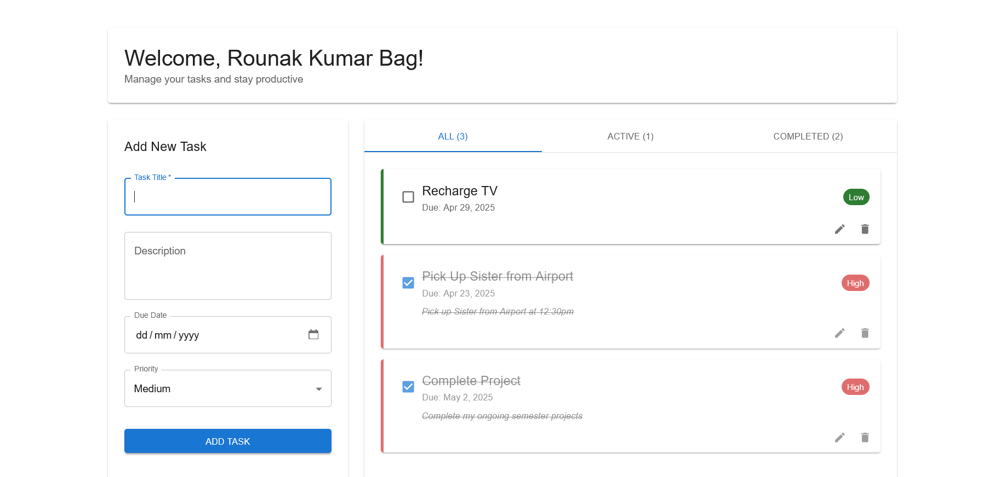

# Taskify

A task management web application built with React, Vite, and Firebase.


## Features

- **User Authentication**
  - Email/password login and registration
  - Google sign-in integration
  - Password reset functionality
  - Profile management

- **Task Management**
  - Create, edit, and delete tasks
  - Mark tasks as complete/incomplete
  - Set priority levels (high, medium, low)
  - Add due dates and descriptions
  - Filter tasks by status (all, active, completed)

- **User Interface**
  - Responsive design for mobile and desktop
  - Clean, modern interface with Material UI
  - Intuitive navigation with protected routes

## Technologies Used

- **Frontend**
  - React 18
  - Vite
  - React Router Dom
  - Material UI

- **Backend Services**
  - Firebase Authentication
  - Firebase Firestore

## Getting Started

### Prerequisites

- Node.js (v16+)
- npm or yarn
- Firebase account

### Installation

1. Clone the repository:
```bash
git clone https://github.com/yourusername/taskify.git
cd taskify
```

2. Install dependencies:
```bash
npm install
```

3. Create a Firebase project:
   - Go to [Firebase Console](https://console.firebase.google.com/)
   - Create a new project named "Taskify"
   - Enable Authentication with Email/Password and Google sign-in methods
   - Create a Firestore database

4. Configure Firebase:
   - Create a `.env` file in the root directory:
   ```
   VITE_FIREBASE_API_KEY=your-api-key
   VITE_FIREBASE_AUTH_DOMAIN=your-project-id.firebaseapp.com
   VITE_FIREBASE_PROJECT_ID=your-project-id
   VITE_FIREBASE_STORAGE_BUCKET=your-project-id.appspot.com
   VITE_FIREBASE_MESSAGING_SENDER_ID=your-messaging-sender-id
   VITE_FIREBASE_APP_ID=your-app-id
   ```
   - Update `src/firebase.js` to use these environment variables:
   ```javascript
   const firebaseConfig = {
     apiKey: import.meta.env.VITE_FIREBASE_API_KEY,
     authDomain: import.meta.env.VITE_FIREBASE_AUTH_DOMAIN,
     projectId: import.meta.env.VITE_FIREBASE_PROJECT_ID,
     storageBucket: import.meta.env.VITE_FIREBASE_STORAGE_BUCKET,
     messagingSenderId: import.meta.env.VITE_FIREBASE_MESSAGING_SENDER_ID,
     appId: import.meta.env.VITE_FIREBASE_APP_ID
   };
   ```

5. Set up Firestore security rules:
```javascript
rules_version = '2';
service cloud.firestore {
  match /databases/{database}/documents {
    match /tasks/{taskId} {
      allow read, write: if request.auth != null && request.auth.uid == resource.data.userId;
      allow create: if request.auth != null && request.resource.data.userId == request.auth.uid;
    }
    match /users/{userId} {
      allow read, write: if request.auth != null && request.auth.uid == userId;
    }
  }
}
```

## Screenshots



### Development

Run the development server:
```bash
npm run dev
```

Visit `http://localhost:5173` to see the application.

### Building for Production

Build the application:
```bash
npm run build
```

This will create a `dist` directory with the production build.

## Deployment

You can deploy this application to Firebase Hosting:

1. Install Firebase CLI:
```bash
npm install -g firebase-tools
```

2. Login to Firebase:
```bash
firebase login
```

3. Initialize Firebase:
```bash
firebase init
```
Select Hosting and choose your Firebase project.

4. Deploy:
```bash
firebase deploy
```

## Project Structure

```
src/
├── components/
│   ├── auth/
│   │   ├── Login.jsx
│   │   ├── Register.jsx
│   │   └── ProtectedRoute.jsx
│   ├── layout/
│   │   ├── Navbar.jsx
│   │   └── Footer.jsx
│   └── tasks/
│       ├── TaskForm.jsx
│       ├── TaskList.jsx
│       └── TaskItem.jsx
├── contexts/
│   └── AuthContext.jsx
├── hooks/
│   └── useTasks.jsx
├── pages/
│   ├── HomePage.jsx
│   ├── LoginPage.jsx
│   ├── RegisterPage.jsx
│   ├── DashboardPage.jsx
│   └── ProfilePage.jsx
├── services/
│   ├── authService.js
│   └── taskService.js
├── utils/
│   └── dateUtils.js
├── App.jsx
├── main.jsx
├── firebase.js
└── index.css
```

## Contributing

1. Fork the repository
2. Create a feature branch:
```bash
git checkout -b feature/amazing-feature
```
3. Commit your changes:
```bash
git commit -m 'Add some amazing feature'
```
4. Push to the branch:
```bash
git push origin feature/amazing-feature
```
5. Open a Pull Request

## License

This project is licensed under the MIT License - see the LICENSE file for details.

## Acknowledgments

- [React](https://reactjs.org/)
- [Vite](https://vitejs.dev/)
- [Firebase](https://firebase.google.com/)
- [Material UI](https://mui.com/)
