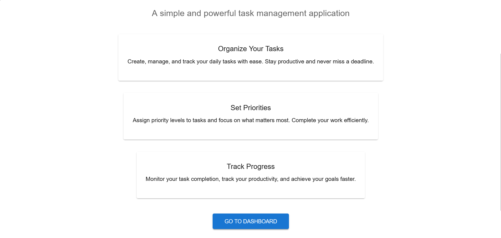
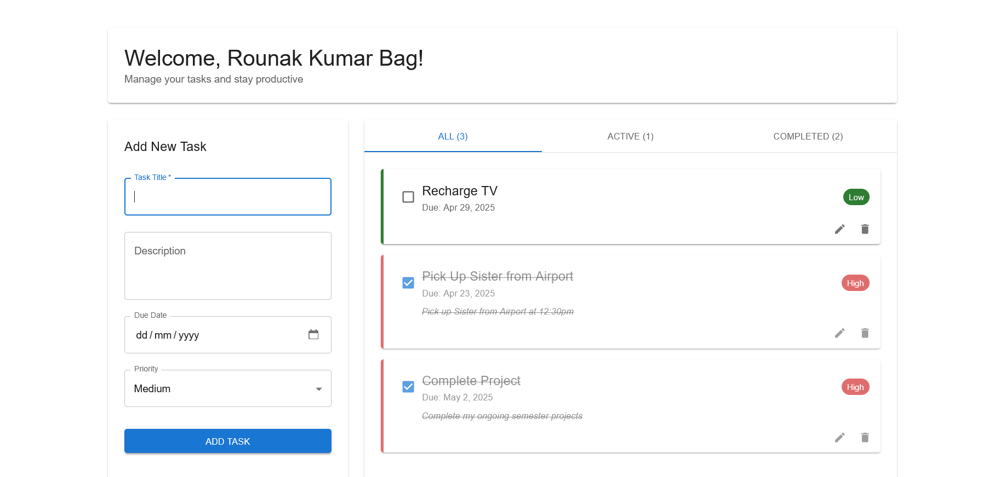

# Taskify

Taskify is a task management application built using React and Vite. It provides a simple and efficient way to manage your daily tasks.

## Features

- Add, edit, and delete tasks
- Mark tasks as completed
- Responsive design for mobile and desktop
- Fast development with Vite

## Tech Stack

- **Frontend**: React, Vite
- **Styling**: Tailwind
- **State Management**: Router

## Screenshots



## Getting Started

Follow these steps to set up and run the project locally:

### Prerequisites

- Node.js (v16 or higher recommended)
- npm or yarn

### Installation

1. Clone the repository:
   ```bash
   git clone https://github.com/your-username/taskify.git
   cd taskify

2. Install dependencies:
    npm install

3. Start the development server
    npm run dev